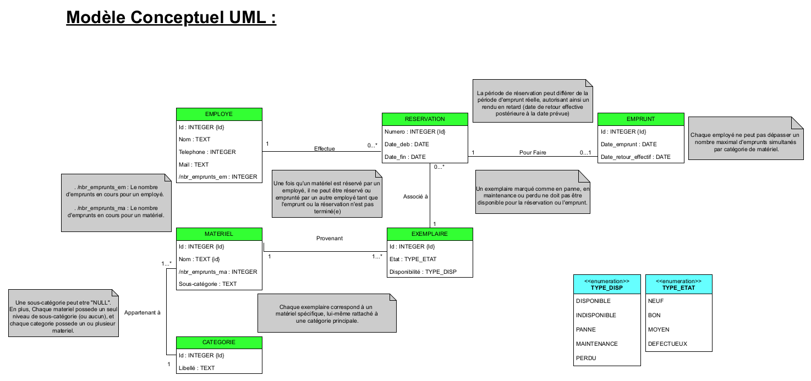
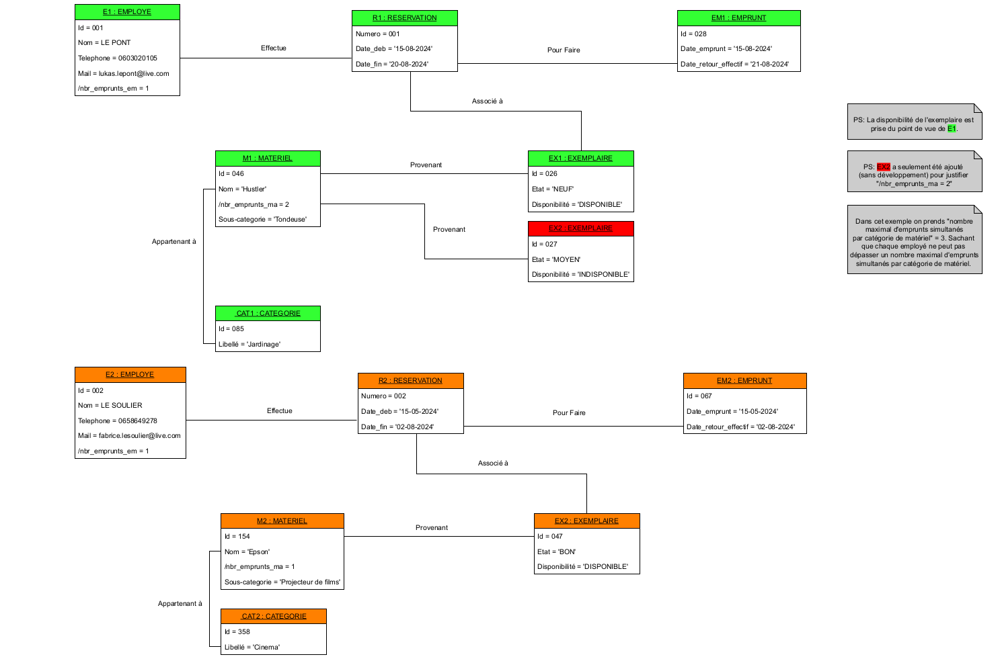
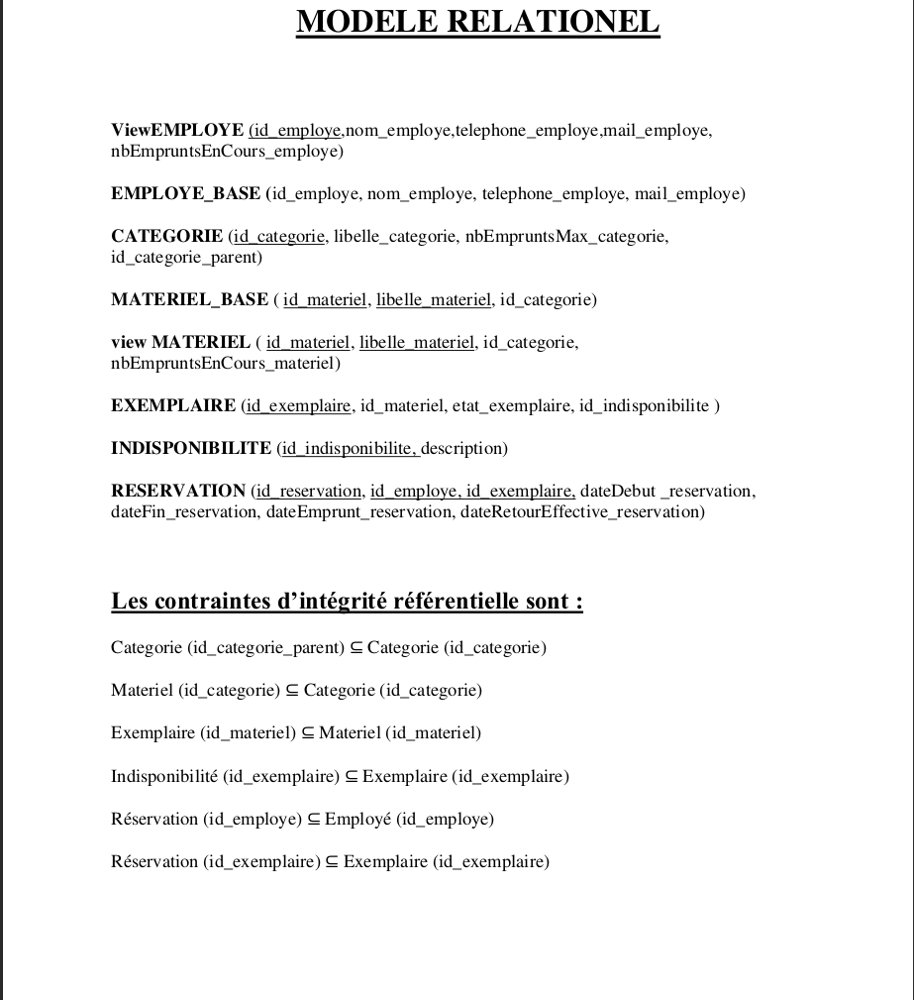
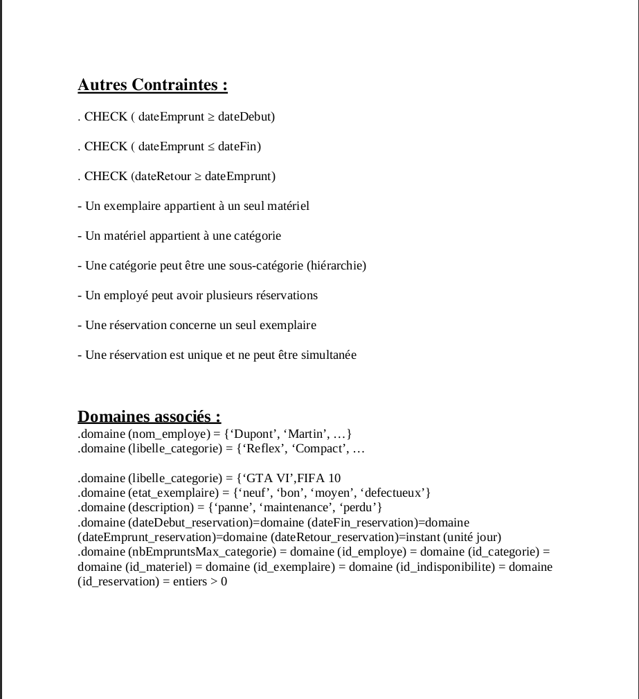

# Projet INF403 en trinome - L2 Informatique UGA : Base de données de gestion des réservations de matériel.
# INF403 Project in collaboration with two teammates - L2 Computer Science at UGA: Equipment Reservations Management Database.

Ce projet porte sur la conception et l'implémentation d'une base de données relationnelle pour la gestion des réservations de matériel au sein d'une organisation. Le système permet de suivre les employés, les catégories de matériel, les exemplaires spécifiques (incluant leur état de maintenance) et l'historique complet des réservations.

### Travail réalisé :
* **Conception UML** : Élaboration du diagramme de classes et du diagramme d'objets pour modéliser les règles de gestion.
* **Modélisation Relationnelle** : Passage du modèle conceptuel au modèle logique avec respect des contraintes d'intégrité (clés primaires, étrangères, checks).
* **Implémentation SQL** : Création des tables, des vues calculant les emprunts en cours, et insertion de données complexes.
* **Analyse de Données** : Rédaction de requêtes SQL avancées (jointures multiples, CTE/WITH, agrégations, sous-requêtes complexes) pour extraire des statistiques de performance.

---

---

This project focuses on the design and implementation of a relational database for managing equipment reservations within an organization. The system tracks employees, material categories, specific items (including maintenance status), and full reservation history.

### Key Technical Features:
* **UML Design**: Developed class and object diagrams to model business rules.
* **Relational Modeling**: Translated conceptual models into logical schemas, ensuring data integrity through primary/foreign keys and constraints.
* **SQL Implementation**: Table creation, view definitions for real-time tracking, and complex data migration.
* **Data Querying**: Advanced SQL scripts involving multiple joins, CTEs (WITH clauses), and complex aggregations to extract operational metrics.
#
---

---

## Conception / Design Models

### Modèle Conceptuel (UML)

### Diagramme d'Objets (UML)

### Modèle Relationnel (MLD)

